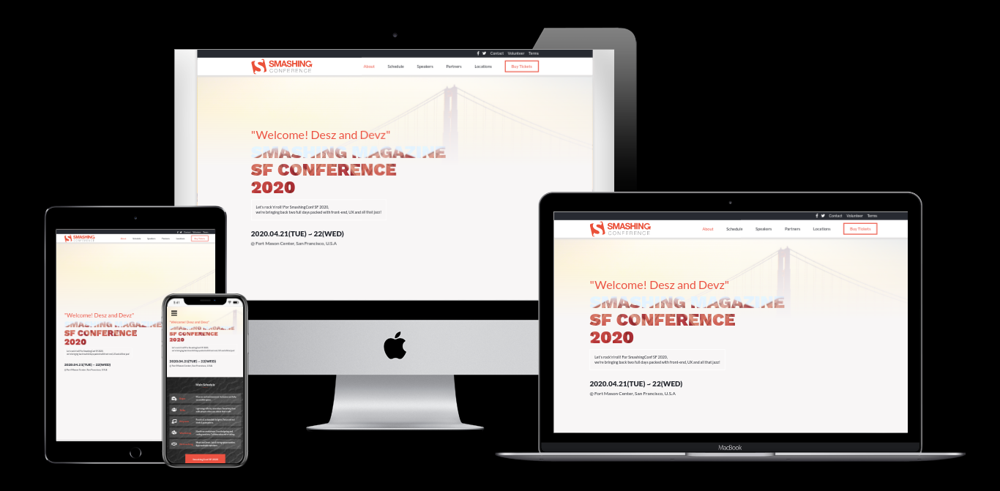

# SmashingConf

> A redesign of the [Smashing Conference website](https://smashingconf.com/sf-2020/), using [this](https://www.behance.net/gallery/29845175/CC-Global-Summit-2015) UI Design created by [Cindy Shin](https://www.behance.net/adagio07).

## Implementation Details

[See wiki pages](https://github.com/cliftondavies/SmashingConf/wiki)

## Tools & Technologies Used

- HTML5
- CSS3
- Font Awesome 5

## Live Demo

[Live Demo Link](https://cliftondavies.github.io/SmashingConf/)

## Authors

👤 **Clifton Davies**

- Github: [@githubhandle](https://github.com/cliftondavies)
- Twitter: [@twitterhandle](https://twitter.com/cliftonaedavies)
- Linkedin: [linkedin](https://www.linkedin.com/in/clifton-davies-mbcs/)

## 🤝 Contributing

Contributions, issues and feature requests are welcome!

Feel free to check the [issues page](https://github.com/cliftondavies/SmashingConf/issues).

## Show your support

Give a ⭐️ if you like this project!

## Acknowledgments

- [Pesticide](https://github.com/mrmrs/pesticide)
- [Cindy Shin](https://www.behance.net/adagio07)
- [Smashing Conference](https://smashingconf.com/sf-2020/)
- [Sam Goodgame](https://unsplash.com/photos/Pe5BC-EDtB4)
- [Basile Bedelek](https://unsplash.com/photos/SNjvN__sSec)
- [Ryan Moreno](https://unsplash.com/photos/w1_4YH5IhDg)
- [TinyPNG](https://tinypng.com/)
- [Image Optimizer](http://www.imageoptimizer.net/Pages/Home.aspx)
- [Border Image Generator](https://border-image.com/)

## 📝 License

This project is [MIT](https://opensource.org/licenses/MIT) licensed.
